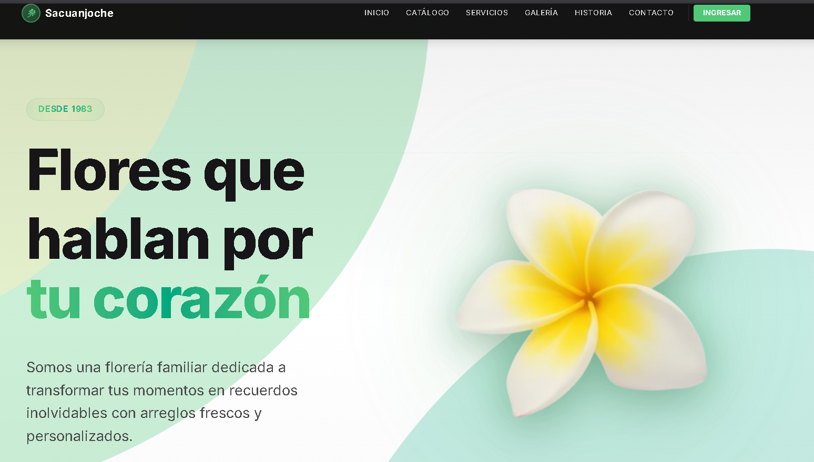
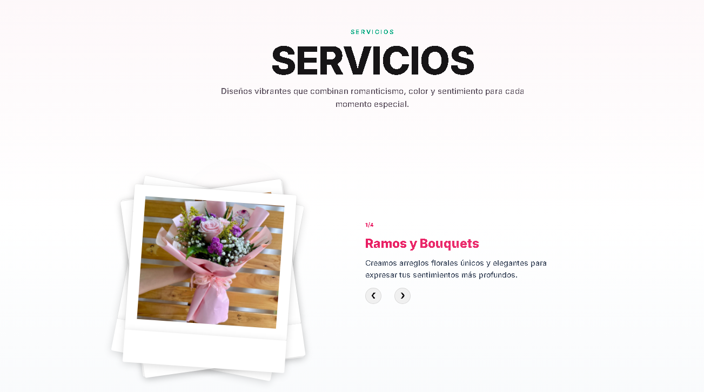

# Dylan Portfolio

<div align="center">


**Portafolio personal construido con Next.js + TypeScript**

Un sitio rápido y moderno para mostrar mis proyectos, habilidades y blog, con animaciones fluidas, modo oscuro y una UI consistente.

</div>

---

## ✨ Descripción

Este repo contiene mi portafolio (App Router) con secciones de **Hero**, **Sobre mí**, **Proyectos**, **Blog**, y páginas legales. Está enfocado en performance, accesibilidad y una experiencia visual cuidada.

---

## 🧰 Tecnologías

> Nota: para el proyecto **Taller MST** (incluido como proyecto destacado) uso el mismo stack que verás aquí abajo, y para **Sacuanjoche** se añade **Supabase**.

<div align="center">
	
	
	
	
	
	
	
	
	
</div>

---

## 🚀 Scripts

```bash
npm run dev     # Levanta el servidor en modo desarrollo
npm run build   # Build de producción
npm run start   # Servir build de producción
npm run lint    # ESLint
```

---

## 📦 Instalación

```bash
npm install
npm run dev
```

Abrir `http://localhost:3000`.

---

## 🖼️ Proyectos (capturas)

### 🔧 Taller MST

Sistema integral de gestión para taller mecánico, clientes, seguros e inventario.

<div align="center">
	
	
</div>

Tecnologías: React · TypeScript · Vite · Tailwind · React Router · TanStack Query · Zustand · Radix UI

---

### 🌸 Floristería Sacuanjoche

Sistema de gestión y catálogo para floristería (inventario, pedidos, facturas, clientes y reportes). Integra almacenamiento de imágenes con **Supabase**.

<div align="center">
	
	
</div>

Tecnologías: React · TypeScript · Vite · Tailwind · React Router · TanStack Query · Zustand · Radix UI · Supabase

---

## 🗺️ Estructura (resumen)

```text
app/            # App Router (layout, páginas, blog)
components/     # UI + secciones + shared
lib/            # utilidades (ej. blog)
public/         # assets (tech icons y capturas de proyectos)
```

---

## 📄 Licencia

Uso personal / portafolio.
